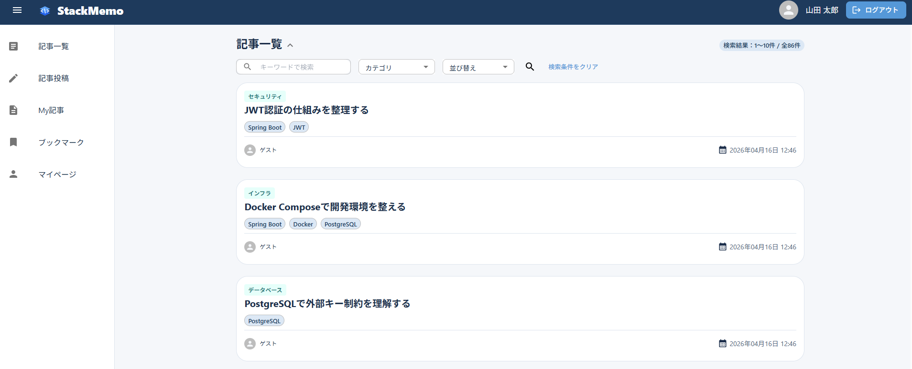
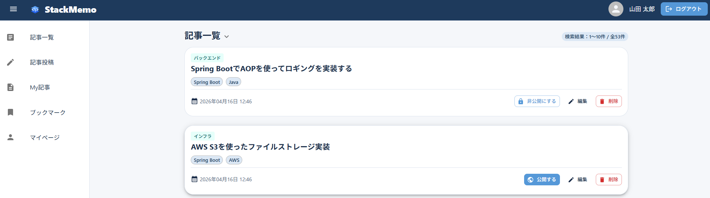
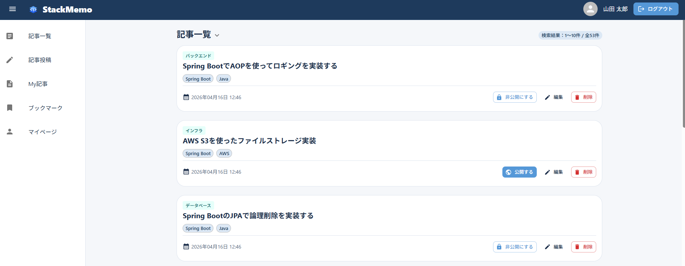
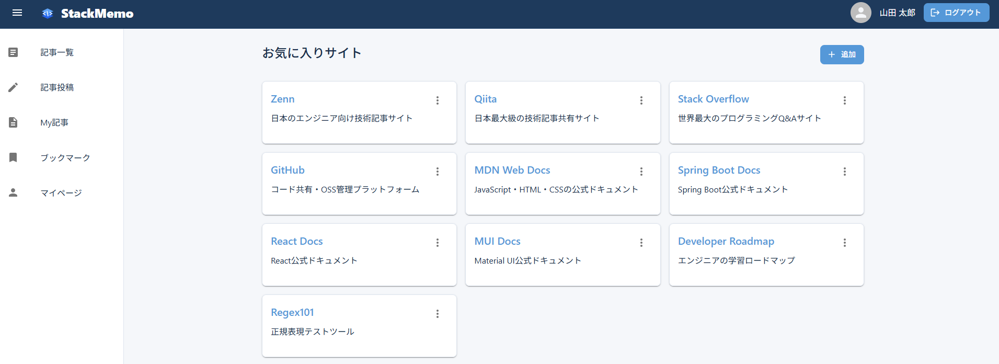
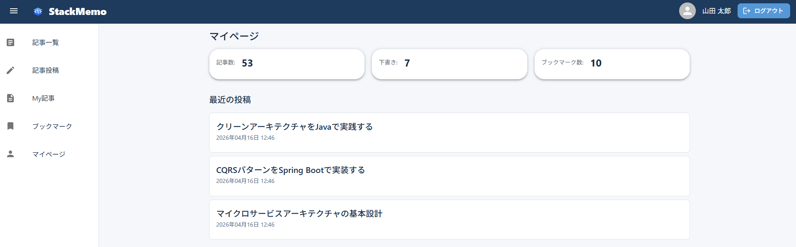
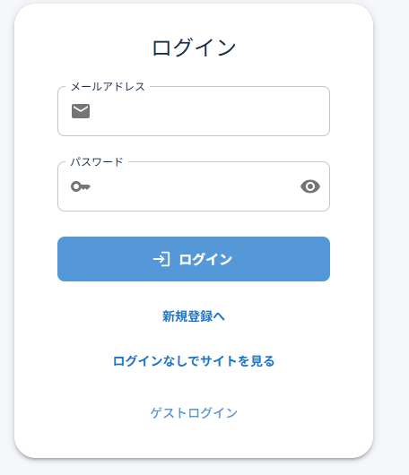
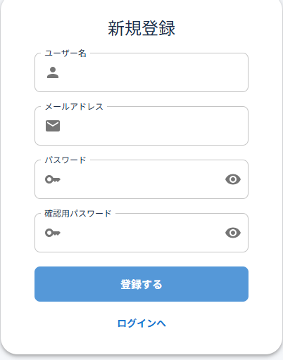

# TechMemo フロントエンド

エンジニア向けの技術メモ共有アプリ「TechMemo」のフロントエンドリポジトリです。


## 関連リポジトリ

| リポジトリ | 説明 |
|---|---|
| [techmemo-backend](バックエンドのGitHubURL) | Spring Boot / JWT / PostgreSQL |
| [techmemo-frontend](フロントエンドのGitHubURL) | React / TypeScript / MUI |

## デプロイ

| 環境 | URL |
|---|---|
| フロントエンド（Vercel） | https://tadahito-techmemo.vercel.app |
| バックエンド（Render） | https://techmemo-p29y.onrender.com |

> ⚠️ バックエンドはRenderの無料プランを使用しているため、初回アクセス時に起動まで数十秒かかることがあります。

---

## 概要

Markdownで技術メモを投稿・管理できるエンジニア向けのナレッジ共有アプリです。
ログインなしでも公開記事の閲覧が可能です。

## スクリーンショット

### 記事一覧
キーワード・カテゴリ・タグ・並び替えで絞り込めます。



### 記事投稿
左がエディタ、右がプレビューのsplitモード。write / previewへの切り替えも可能です。



### My記事
自分の記事一覧では公開/非公開の切り替え・編集・削除を一覧から操作できます。



### ブックマーク
よく参照するサイトをタイトル・URL・メモ付きで登録・管理できます。



### マイページ
投稿数・下書き数・ブックマーク数の集計と最近の投稿を確認できます。



### ログイン / 新規登録

<div>




</div>

### ゲストアカウント
---

## 機能一覧

### 記事

- キーワード・カテゴリ・タグによる絞り込み検索とページネーション
- Markdownエディタ（write / preview / split の3モード切り替え）
- 記事への参考URL紐付け（最大5件）
- 公開 / 非公開の切り替え（一覧から1クリックで変更）
- 未保存の状態でページを離れようとした際の離脱ガード

### その他

- いいね機能（自分の記事・未ログイン時は無効）
- ブックマーク管理（お気に入りサイトの登録・編集・削除）
- マイページ（投稿数・下書き数・ブックマーク数の集計、最近の投稿一覧）

### 認証

- JWTアクセストークン + HTTPOnly Cookieのリフレッシュトークンによる認証
- ページ読み込み時にリフレッシュトークンで自動ログイン
- 401エラー時にトークンを自動更新して再リクエスト

---

## 技術スタック

| カテゴリ | 採用技術 |
|---|---|
| フレームワーク | React 19 + TypeScript |
| ビルドツール | Vite 7 |
| UIライブラリ | MUI (Material UI) v7 |
| スタイリング | MUI sx prop / Tailwind CSS v4（補助） |
| ルーティング | React Router DOM v7 |
| フォーム管理 | React Hook Form + Zod |
| Markdownエディタ | CodeMirror 6（@uiw/react-codemirror） |
| Markdownレンダリング | react-markdown + remark-gfm + remark-breaks |
| HTTPクライアント | Axios |
| 日付ユーティリティ | date-fns |
| Linter | ESLint 9 + typescript-eslint |

---

## 設計上の工夫

### publicApi / privateApi の分離

```ts
// src/services/axios.ts
export const publicApi = axios.create({ ... });  // 認証不要
export const privateApi = axios.create({ ... }); // Bearerトークン自動付与
```

認証が必要なエンドポイントとそうでないものを呼び出し元から意識せずに使い分けられるよう、
Axiosインスタンスを2つに分離しました。
`privateApi` はリクエストインターセプターでトークンを自動付与し、
401レスポンス時にはリフレッシュトークンで再取得してからリクエストをリトライします。

### 検索条件をURLクエリパラメータで管理

```ts
// useArticleList.ts
const [searchParams, setSearchParams] = useSearchParams();
const page = Number(searchParams.get("page") ?? "1");
const keyword = searchParams.get("keyword") ?? "";
```

キーワード・カテゴリ・タグ・ページ番号をすべてURLで管理しているため、
ブラウザバックや直リンクで同じ検索状態を再現できます。

### バリデーションスキーマの分離

```ts
// schema/schema.ts
export const articleContentSchema = z.object({ title, tags, content });
export const articleMetaSchema    = z.object({ categoryId, url });
export const articleEditSchema    = z.object({ ...articleContentSchema.shape, ...articleMetaSchema.shape });
```

記事の本文系バリデーション（`articleContentSchema`）とメタ情報系（`articleMetaSchema`）を
分離して定義しています。投稿と更新で同じスキーマを共有できるためバリデーションロジックの重複を防いでいます。

### 離脱ガード

```ts
useBeforeUnload(formState.isDirty);       // ブラウザ/タブを閉じるとき
useUnsavedChangesWarning(formState.isDirty); // SPA内のルート移動
```

記事投稿・編集ページで未保存の変更がある場合、ブラウザの離脱とSPA内のページ遷移の両方でユーザーに確認ダイアログを表示します。

---

## アーキテクチャ

フロントエンド (React + Vite / Vercel)
↓ HTTPS / JWT Bearer Token
バックエンド (Spring Boot / Render)
↓ JPA / SQL
PostgreSQL (Render)
